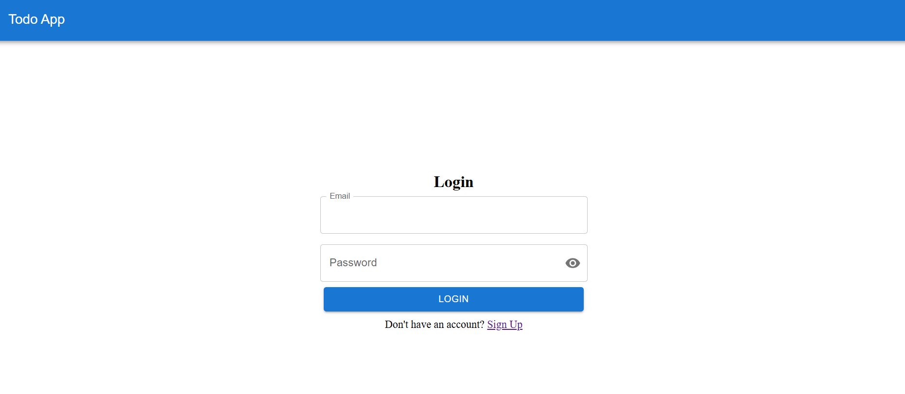
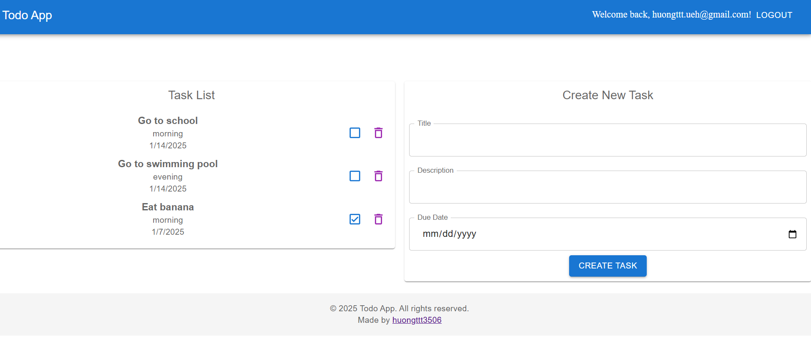
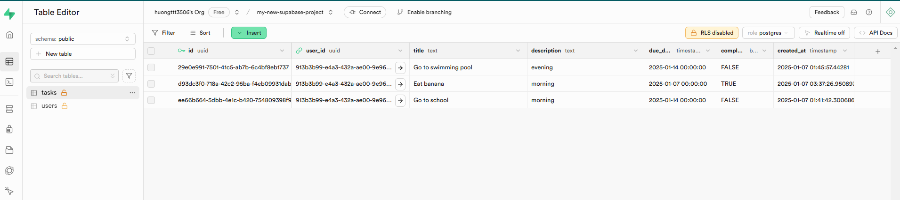

# React TODO web app
A simple todo web app built with ReactJS in TypeScript. Basically a PoC on a React SPA with Supabase as its backend.
## Features
- Sign up, sign in.
- Add, delete task.
- Mark tasks as completed.
- Supabase integration for storing tasks.

## Screenshots
### UI of the Todo App
  


  

### Supabase Integration
 

## Technologies Used
- **ReactJS** with **TypeScript**
- **Supabase** for backend and authentication
- **Material UI** for UI

## How to run
Clone from the local branch
```bash
git clone https://github.com/huongttt3506/Supabase-React-Typescript-TodoApp
```

Install dependencies then start the app in one terminal..

```bash
npm install
```

Run the app
```bash
npm run dev
```

Access http://localhost:5173 in your browser

## Configuration
Set up your Supabase account and create a new project.
Add your Supabase URL and API Key to the environment variables or configuration files (e.g., .env file) based on the project setup.


